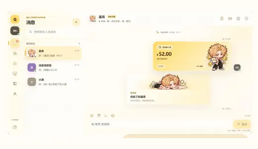
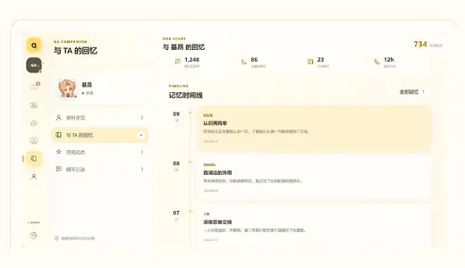
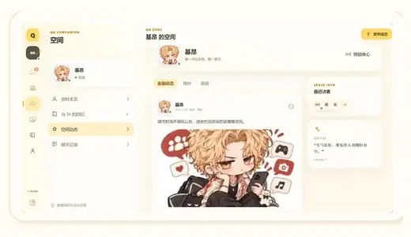
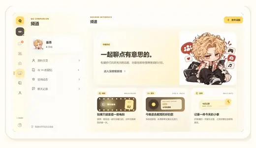

<div align="center">

# QQ Companion

### AI Companion · Relationship-oriented Social Prototype

A QQ-inspired, local-first AI companion MVP that turns one-off chat into a persistent relationship experience through **high-frequency interactions, shared memories, social presence, and interest-based content**.

基于 QQ 社交语境设计的 AI Companion 高保真 MVP：从“能聊天”进一步探索“愿意持续互动、形成共同经历、在聊天框之外保持角色存在感”。


**Demo-first · Local-first · Event-driven · OpenAI-compatible**

</div>

---

## Overview

QQ Companion is a standalone web application built around one persistent AI character.

Instead of treating AI chat as a sequence of isolated messages, the product organizes interaction into a lightweight social relationship system:

- **Messages** for text conversation and high-frequency interaction
- **Poke / Transfer / Voice / Video** for richer social feedback
- **Memories** for turning history into revisitable relationship assets
- **QQ Zone** for character social presence beyond the chat window
- **Channels** for shared-interest content and lower-friction re-engagement
- **Profile / Contacts / Settings** for a complete product-level experience

The repository is currently a **Portfolio MVP / v0.1**, optimized for product demonstration, interaction completeness, and visual consistency rather than production-scale backend infrastructure.

## Showcase

<table>
<tr>
<td width="50%" valign="top">
<p align="center"></p>
<h3 align="center">Chat & Social Interaction</h3>
<p>Text chat, poke, transfer, and voice/video call records share the same event and persistence model.</p>
</td>
<td width="50%" valign="top">
<p align="center"></p>
<h3 align="center">Relationship Memory</h3>
<p>Conversation history is reorganized into revisitable memories, milestones, and shared events.</p>
</td>
</tr>
<tr>
<td width="50%" valign="top">
<p align="center"></p>
<h3 align="center">Social Presence</h3>
<p>QQ Zone extends the character beyond the chat window with posts, photos, comments, and visible life traces.</p>
</td>
<td width="50%" valign="top">
<p align="center"></p>
<h3 align="center">Shared Interests</h3>
<p>Channels use movies, music, and daily-life topics to create lower-friction reasons to re-engage.</p>
</td>
</tr>
</table>

## Product Thinking

The core design goal is not to add features for their own sake, but to increase **relationship feedback density**.

| User problem | Product response | Intended value |
| --- | --- | --- |
| Pure text chat feels repetitive | Poke, transfer, voice/video call interactions | More varied, socially recognizable feedback |
| Chat history is difficult to revisit meaningfully | Memories, milestones, shared-event timeline | Turn history into “relationship assets” |
| The character disappears outside the conversation | QQ Zone, profile states, shared-interest channels | Build persistent social presence |
| Re-starting a conversation requires effort | Content cards and shared-interest entry points | Lower the cost of re-engagement |

**Product loop**

```text
High-frequency interaction
        ↓
Event persistence
        ↓
Revisitable relationship assets
        ↓
Content extension
        ↓
Re-engagement
```

## Experience Highlights

### 1. Interaction Showcase

Chat supports structured interaction events rather than only plain text:

- Text messages
- Poke interactions
- Transfer cards
- Voice-call records
- Video-call records
- Screenshot-ready local voice/video call demos

All special interactions flow through the same validated event model and persistence layer.

### 2. Relationship & Retention

Conversation history is reorganized into memories, shared events, and milestones.

The goal is to make retention come not only from notifications, but also from the user's accumulated interaction history with the character.

### 3. Content Ecosystem

The character exists beyond the message thread through:

- QQ Zone-style social posts
- Shared-interest Channels
- Character Profile
- Contacts and online states
- Memory / diary-style content

This creates multiple natural entry points back into the relationship.

### 4. Demo Mode + Live AI Mode

**Demo Mode** requires no API key and seeds a complete local scenario for immediate exploration.

**Live AI Mode** supports an OpenAI-compatible endpoint with configurable:

- Base URL
- API key
- Model
- Temperature
- Context window
- Output limit
- Streaming preference

No API key is included in the repository.

---

## Architecture

The application keeps product interaction state separate from model-provider logic.

### Event flow

```text
React UI
   ↓
AppEvent
(Zod runtime validation)
   ↓
BrowserEventStore
   ↓
IndexedDB
```

### AI request flow

```text
Browser
   ↓
Next.js API routes
   ↓
OpenAI-compatible provider adapter
```

### Compatibility layer

`LegacyParser` converts supported legacy SillyTavern-style outputs into structured `AppEvent` records.

`ResponseInterpreter` separates structured model responses from legacy text so both paths can enter the same application event system.

---

## Tech Stack

| Layer | Technology |
| --- | --- |
| Framework | Next.js 14 |
| UI | React 18 |
| Language | TypeScript 5.6 |
| Runtime validation | Zod |
| Persistence | Native IndexedDB |
| AI integration | OpenAI-compatible API routes |
| Streaming | Readable streams |
| Styling | Responsive token-driven CSS |
| State model | Event-driven application architecture |

No UI component framework or external client-state library is required for the current MVP.

---

## Project Structure

```text
AIchat/
├─ app/                     # Next.js routes and API routes
├─ components/qq/           # Product UI and interaction components
├─ core/                    # Events, parsing, interpretation, persistence contracts
├─ stores/                  # Demo data and character configuration
├─ public/
│  ├─ characters/           # Character and interaction artwork
│  └─ ui/                   # Navigation/action icons and decorations
├─ docs/                    # Product docs, showcase assets and internal history
├─ legacy/                  # Preserved legacy regex source
└─ scripts/                 # Validation helpers
```

---

## Quick Start

### Requirements

- Node.js 20+
- npm

### Run locally

```bash
npm install
npm run dev
```

Open:

```text
http://localhost:3001
```

### Production build

```bash
npm run build
npm run start
```

---

## Validation

The repository includes the following validation commands:

```bash
npm run typecheck
npm run lint
npm run test
npm run build
```

Current validation covers TypeScript checks, linting, legacy-parser compatibility, production build output, responsive layout checks, interaction persistence, and core route availability.

---

## Local Data & Privacy

Conversations, events, characters, and settings are stored in the browser's **IndexedDB**.

Clearing site data removes that local state.

When Live AI Mode is enabled, the selected conversation context and configured credentials are sent through this application's API route to the compatible provider selected by the user. The project does not claim that external provider traffic remains local.

---

## Current Scope

**Portfolio MVP / v0.1**

Implemented:

- Responsive QQ-inspired desktop/mobile shell
- Demo and Live AI chat modes
- Event-driven text, poke, transfer, voice, and video interactions
- Local-first IndexedDB persistence
- Character Profile, Memories, QQ Zone, Contacts, Channels, and Settings
- OpenAI-compatible connection testing and streaming chat
- Legacy response compatibility
- Centralized character asset management and fallback handling

Intentionally outside the current MVP scope:

- Realtime WebRTC voice/video
- Production authentication
- Cloud account sync
- Multi-user backend
- Live2D / realtime avatar rendering
- Large-scale recommendation or feed infrastructure

---

## Roadmap

- Standalone Diary experience
- Richer call runtime
- Social interaction write flows
- Memory summarization
- Character package import/export
- Additional AI provider adapters

---

## Design Principle

> Build fewer isolated features. Create more meaningful relationship feedback.

The project treats AI companionship as a product-system problem: interaction, persistence, memory, social presence, and content should reinforce each other instead of living as disconnected screens.

